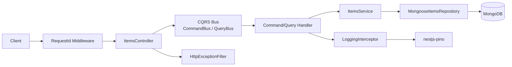
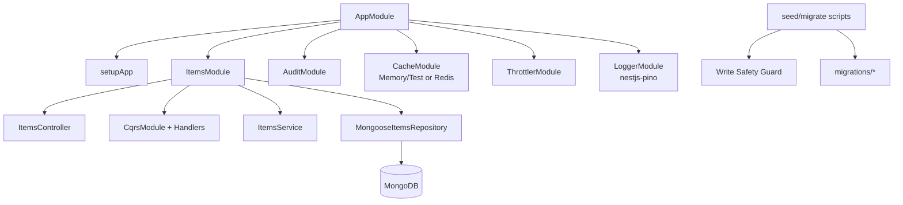

# nest-basics

Production-style **learning** API built with NestJS + Mongoose.

This project demonstrates how to keep a small CRUD API simple while still practicing practical backend concerns: validated configuration, consistent error contracts, request correlation, caching, throttling, security middleware, structured logging, migrations/seeding safety, CQRS-style orchestration, and strong automated tests.

## Quick Start

### Prerequisites

- Node.js 20+
- npm
- Docker + Docker Compose

### 1) Install dependencies

```bash
npm install
```

### 2) Start MongoDB (replica set required)

```bash
docker compose -f docker-compose.replset.yml up
```

Mongo transactions require a replica set. Item creation uses transactions, so `docker-compose.replset.yml` is the correct local default.

### 3) Configure environment

Create:

- `.env` for local/dev runs
- `.env.test` for test runs

Required variable:

- `MONGO_URI`

Common optional variables:

- `PORT`
- `REDIS_URL`
- `CORS_ORIGIN`
- `CORS_METHODS`
- `CORS_CREDENTIALS`
- `COMPRESSION`

### 4) Run app and tests

```bash
npm run start:dev
npm run test
```

### 5) Optional data tooling

```bash
npm run migrate
npm run seed
```

---

## Project Overview

This API is an educational baseline that demonstrates:

- ConfigModule + Joi environment validation
- Mongoose schema modeling + index strategy
- Migrations + idempotent seed scripts (tsx)
- Script safety guard for write operations
- Unified HTTP error contract with request correlation
- Cache layer with optional Redis backing + invalidation/versioning
- Throttling with `@nestjs/throttler` (enabled outside test env)
- Security middleware: Helmet, CORS policy, compression, production-safe 500 policy
- Structured logging with `nestjs-pino` + redaction policy
- Basic CQRS split (`Controller -> Bus -> Handler -> Service -> Repository`)
- Test pyramid: unit + integration + e2e + contract snapshots + OpenAPI snapshot
- Tooling quality gates: `lint` + `typecheck`

---

## Scripts

- `npm run start` — run compiled app (`dist/main.js`)
- `npm run start:dev` — run in watch mode
- `npm run build` — compile TypeScript
- `npm run test` — full test suite
- `npm run test:e2e` — e2e-focused suite under `test/`
- `npm run test:redis` — redis cache smoke test
- `npm run typecheck` — TypeScript checks (`tsc --noEmit`)
- `npm run lint` — lint source/test/scripts/migrations
- `npm run lint:fix` — auto-fix lint issues where possible
- `npm run migrate` — run migrations once per migration name
- `npm run seed` — idempotent seed upserts

### Migration/seed safety notes

- Scripts refuse writes in `NODE_ENV=production`
- Scripts validate `MONGO_URI` to reduce accidental writes to suspicious targets
- Migrations are tracked in a `migrations` collection (idempotent execution)
- Seed is idempotent (`$setOnInsert` by `name`)

---

## API Documentation

- Swagger UI: `GET /docs` (non-test environment)
- OpenAPI spec is snapshot-tested to keep docs/contracts stable

### Endpoints

- `GET /items/health`
- `GET /items`
- `GET /items/search`
- `GET /items/:id`
- `POST /items`
- `PATCH /items/:id`
- `DELETE /items/:id`

### Pagination/filtering (high-level)

- List/search endpoints accept pagination (`page`, `limit`) and sorting inputs
- Supports `done`, text search (`q`), and substring search (`like`)
- Response includes `data` + pagination `meta`

### Unified error response

```json
{
  "statusCode": 400,
  "error": "Bad Request",
  "message": ["name must be longer than or equal to 1 characters"],
  "path": "/items",
  "timestamp": "2026-03-04T12:00:00.000Z",
  "requestId": "c83cb856-5688-42a9-a247-ca5842f8b61e"
}
```

`x-request-id` is optional on incoming requests and echoed back in headers and error payloads.

---

## Architecture

### Folder structure

```text
src/
	app.module.ts
	app.setup.ts
	main.ts
	common/
		cache/
		filters/
		interceptors/
		logging/
		middleware/
		pipes/
	audit/
	items/
		commands/
		queries/
		dto/
		domain/
		infrastructure/
scripts/
	migrate.ts
	seed.ts
	_lib/
migrations/
test/
	utils/
```

### CQRS flow (what is intentionally split)

- Controller handles transport concerns and Swagger docs
- Controller delegates to `QueryBus` / `CommandBus`
- Handlers delegate to existing `ItemsService` methods
- Service orchestrates transactions, cache invalidation, and domain operations
- Repository encapsulates Mongoose query details

This keeps the learning scope focused while showing a practical CQRS boundary.

### Request flow diagram



### Component diagram



---

## Caching

- Test env uses in-memory cache
- Non-test env uses Redis when `REDIS_URL` is set (otherwise memory fallback)
- Item details and list responses are cached
- Write operations invalidate item cache and bump list version
- List version bump uses atomic increment path when Redis store exposes increment support

---

## Security

- Helmet headers enabled
- CORS allowlist policy with configurable origins/methods/credentials
- Compression enabled by default (can be disabled via `COMPRESSION=false`)
- Throttling enabled outside tests; dedicated e2e verifies 429 behavior
- Production unknown errors return safe generic message

---

## Logging

- Structured request logs via `nestjs-pino`
- Request correlation through `x-request-id`
- Sensitive values redacted (authorization, cookies, tokens, etc.)
- Startup message also uses structured logger

Example (trimmed):

```json
{
  "level": 30,
  "msg": "request completed",
  "requestId": "c83cb856-5688-42a9-a247-ca5842f8b61e",
  "method": "GET",
  "path": "/items",
  "statusCode": 200,
  "ms": 12
}
```

---

## Testing

- **Unit tests**: service/handler behavior
- **Integration tests**: repository + real Mongo behavior
- **E2E tests**: API behavior, validation, security middleware, throttling, cache invalidation
- **Contract snapshots**: response shape stability
- **OpenAPI snapshot**: documentation contract stability

Run all tests:

```bash
npm run test
```

---

## Roadmap (realistic next steps)

- Add CI workflow for lint + typecheck + tests
- Add health/readiness split endpoints (liveness/readiness)
- Add lightweight metrics/observability hooks
- Continue evolving boundaries toward cleaner application/domain layering
